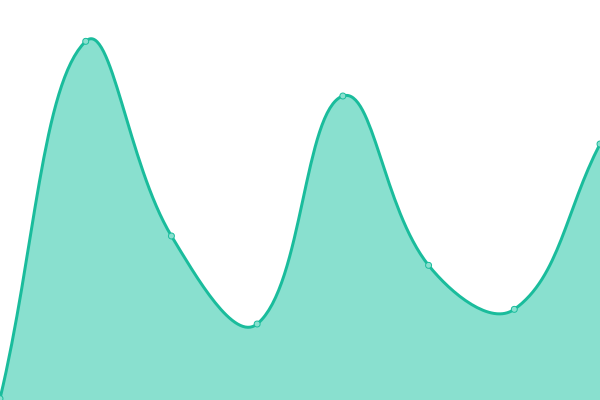
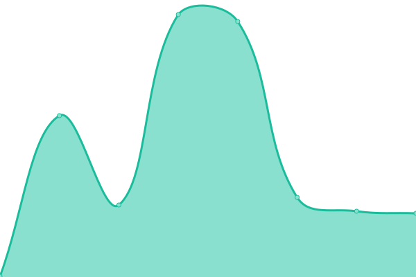
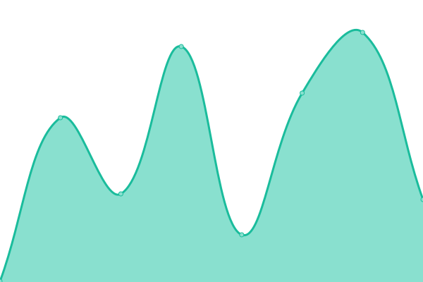
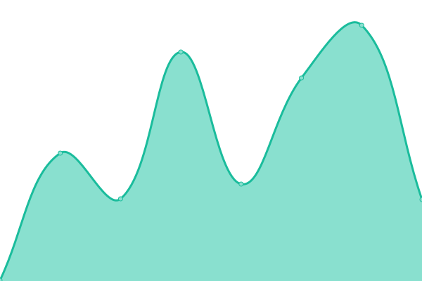

# [📈 Live Status](https://status.centralplus.io): <!--live status--> **🟩 All systems operational**

This repository contains the open-source uptime monitor and status page for [Central Developers](https://status.centralplus.io), powered by [Upptime](https://github.com/upptime/upptime).

With [Upptime](https://upptime.js.org), you can get your own unlimited and free uptime monitor and status page, powered entirely by a GitHub repository. We use [Issues](https://github.com/centraldevelopers/status.centralplus.io/issues) as incident reports, [Actions](https://github.com/centraldevelopers/status.centralplus.io/actions) as uptime monitors, and [Pages](https://status.centralplus.io) for the status page.

<!--start: status pages-->
<!-- This summary is generated by Upptime (https://github.com/upptime/upptime) -->
<!-- Do not edit this manually, your changes will be overwritten -->
<!-- prettier-ignore -->
| URL | Status | History | Response Time | Uptime |
| --- | ------ | ------- | ------------- | ------ |
|  [App Production](https://app.centralplus.io) | 🟩 Up | [app-production.yml](https://github.com/centraldevelopers/status.centralplus.io/commits/HEAD/history/app-production.yml) | 

 281ms
     
 | 

<a href="https://status.centralplus.io/history/app-production">100.00%</a>
    

|  [App Staging](https://app-staging.centralplus.io) | 🟩 Up | [app-staging.yml](https://github.com/centraldevelopers/status.centralplus.io/commits/HEAD/history/app-staging.yml) | 

 187ms
     
 | 

<a href="https://status.centralplus.io/history/app-staging">100.00%</a>
    

|  [Admin Production](https://admin.centralplus.io) | 🟩 Up | [admin-production.yml](https://github.com/centraldevelopers/status.centralplus.io/commits/HEAD/history/admin-production.yml) | 

 416ms
     
 | 

<a href="https://status.centralplus.io/history/admin-production">100.00%</a>
    

|  [Admin Staging](https://admin-staging.centralplus.io) | 🟩 Up | [admin-staging.yml](https://github.com/centraldevelopers/status.centralplus.io/commits/HEAD/history/admin-staging.yml) | 

 125ms
     
 | 

<a href="https://status.centralplus.io/history/admin-staging">100.00%</a>
    

|  [Api Production](https://api.centralplus.io) | 🟩 Up | [api-production.yml](https://github.com/centraldevelopers/status.centralplus.io/commits/HEAD/history/api-production.yml) | 

 180ms
     
 | 

<a href="https://status.centralplus.io/history/api-production">100.00%</a>
    

|  [Api Staging](https://api-staging.centralplus.io) | 🟩 Up | [api-staging.yml](https://github.com/centraldevelopers/status.centralplus.io/commits/HEAD/history/api-staging.yml) | 

 218ms
     
 | 

<a href="https://status.centralplus.io/history/api-staging">100.00%</a>
    

<!--end: status pages-->

[**Visit our status website →**](https://status.centralplus.io)

## 📄 License

- Powered by: [Upptime](https://github.com/upptime/upptime)
- Code: [MIT](./LICENSE) © [Central Developers](https://status.centralplus.io)
- Data in the `./history` directory: [Open Database License](https://opendatacommons.org/licenses/odbl/1-0/)
